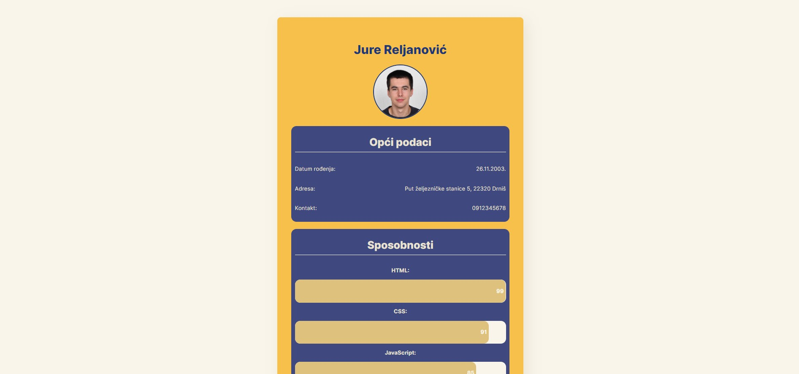

In March 2023 I attended a 2-month long React education at [Digitalna Dalmacija](https://digitalnadalmacija.hr/). The education lasted for 8 weeks, and every week I was required to build a new project. This is the projects I build in the 1st week.

## Table of contents

- [Screenshot](#screenshot)
- [Links](#links)
- [Built with](#built-with)
- [What I learned](#what-i-learned)

### Screenshot

### Links

- Live Site URL: https://jure-reljanovic-juniordev-w1.netlify.app/

### Built with

- [React](https://reactjs.org/)

### What I learned

The first week was very easy. I had an advantage that I was already quite familiar with React and as a result didn't have any dificulties in the start, unlike some of other participants who newer used React before the education.
